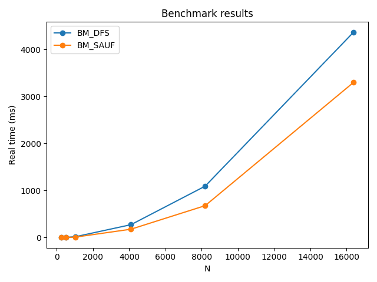

# unique_components
The purpose of the repository is to investigate algorithms to count unique components in 2D image

The SAUF algorithm is implemented based on the publication [Two Strategies to Speed up Connected Component Labeling Algorithms](https://sdm.lbl.gov/~kewu/ps/LBNL-59102.pdf)  

**Dependencies**
This code requires installed [BENCHMARK](https://github.com/google/benchmark) library

**Run command:**
```
build/unique_components --benchmark_out=results.json --benchmark_out_format=json
```

# Results:

```
--------------------------------------------------------------
Benchmark                    Time             CPU   Iterations
--------------------------------------------------------------
BM_DFS/256/256         1007672 ns      1007632 ns          679
BM_DFS/512/512         4116153 ns      4114585 ns          171
BM_DFS/1024/1024      16589908 ns     16584310 ns           43
BM_DFS/4096/4096     273172681 ns    273145184 ns            3
BM_DFS/8192/8192    1093504308 ns   1093395984 ns            1
BM_DFS/16384/16384  4371074218 ns   4370663100 ns            1
BM_SAUF/256/256         492596 ns       492555 ns         1414
BM_SAUF/512/512        2034300 ns      2034135 ns          344
BM_SAUF/1024/1024      8341110 ns      8339878 ns           84
BM_SAUF/4096/4096    176913653 ns    176899822 ns            4
BM_SAUF/8192/8192    678177227 ns    678133869 ns            1
BM_SAUF/16384/16384 3302648261 ns   3302228419 ns            1
```

